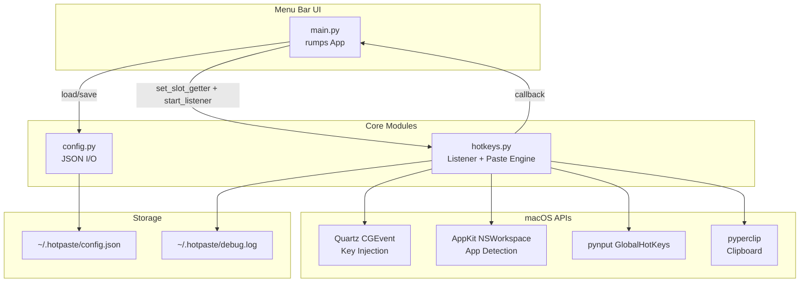
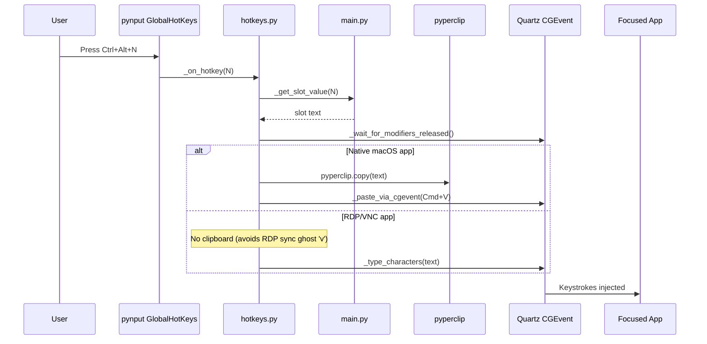
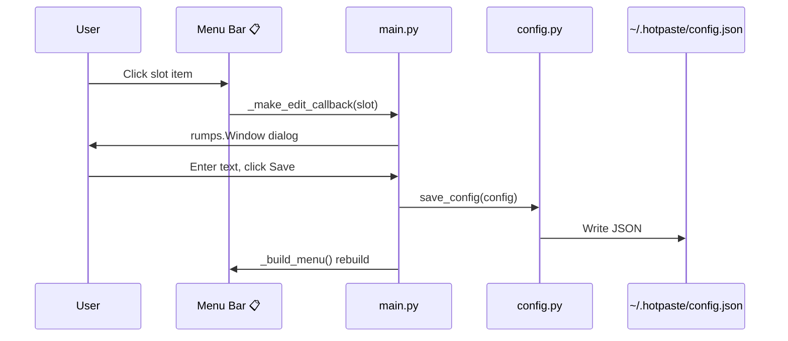

# Codebase Map

> Auto-generated by Cartographer. Last mapped: 2026-03-10

## System Overview



## Directory Structure

```
hotkeyexpander/
├── hotpaste/                    # Application package
│   ├── main.py                  # Entry point - rumps menu bar app
│   ├── config.py                # Config load/save (~/.hotpaste/config.json)
│   ├── hotkeys.py               # Global hotkey listener + paste engine
│   ├── requirements.txt         # pip dependencies (rumps, pynput, pyperclip)
│   ├── com.hotpasteextender.app.plist   # macOS LaunchAgent for auto-start
│   ├── README.md                # User documentation
│   └── tests/
│       ├── __init__.py
│       └── test_config.py       # Unit tests for config module
├── docs/
│   └── plans/
│       ├── 2026-03-04-hotpaste-design.md          # Architecture decisions
│       └── 2026-03-04-hotpaste-implementation.md   # TDD implementation plan
├── instructions.md              # Original product requirements
└── .claude/
    └── settings.local.json      # Claude Code permissions
```

## Module Guide

### main.py (Entry Point)

**Purpose**: Menu bar app that owns config state, renders slot menu, handles editing.
**Class**: `HotPasteExtenderApp(rumps.App)` — title `📋`, 5 editable slots.
**Key methods**: `__init__`, `_build_menu`, `_make_edit_callback(slot)`, `_get_slot_value(slot)`
**Dependencies**: `rumps`, `config`, `hotkeys`

### config.py (Config Layer)

**Purpose**: Pure I/O for loading/saving slot config as JSON.
**Exports**: `CONFIG_DIR`, `CONFIG_PATH`, `DEFAULT_CONFIG`, `load_config()`, `save_config(config)`
**Storage**: `~/.hotpaste/config.json` — 5 string slots keyed `"1"` through `"5"`
**Dependencies**: stdlib only (`json`, `os`)

### hotkeys.py (Hotkey + Paste Engine)

**Purpose**: Global hotkey listener (Ctrl+Alt+1–5) and text pasting with RDP/VNC support.
**Exports**: `set_slot_getter(fn)`, `start_listener()`
**Key internals**:
- `_paste_text(text)` — orchestrates paste (Cmd+V for native macOS, char-typing for RDP)
- `_paste_via_cgevent(use_ctrl)` — low-level Cmd+V or Ctrl+V via Quartz
- `_type_characters(text)` — character-by-character CGEvent typing for RDP apps
- `_get_frontmost_bundle_id()` — detects active app via NSWorkspace
- `_wait_for_modifiers_released()` — polls HID state before pasting
**Dependencies**: `pyperclip`, `pynput`, `AppKit` (pyobjc), `Quartz` (pyobjc)

### tests/test_config.py

**Purpose**: 5 pytest tests covering config defaults, load, save, and directory creation.
**Run with**: `cd hotpaste && python -m pytest tests/test_config.py -v`

## Data Flow

### Hotkey Trigger Flow



### Config Edit Flow



## Conventions

- **Hotkeys**: Ctrl+Alt+1 through Ctrl+Alt+5
- **Config location**: `~/.hotpaste/config.json`
- **Debug log**: `~/.hotpaste/debug.log`
- **Commit style**: Conventional commits (`feat:`, `fix:`, `docs:`, `chore:`)
- **Testing**: pytest with monkeypatch for module-level globals; run from `hotpaste/` dir
- **Dependency injection**: Callback pattern (`set_slot_getter`) decouples hotkeys from UI

## Gotchas

- **Missing pyobjc in requirements.txt**: `AppKit` and `Quartz` imports require `pyobjc-framework-Quartz` and `pyobjc-framework-AppKit`, not listed in `requirements.txt`
- **US keyboard layout hardcoded**: `_KEYCODE_MAP` in hotkeys.py assumes US layout; RDP character typing will be wrong on other layouts
- **No config validation**: Malformed `config.json` crashes the app on startup with `json.JSONDecodeError`
- **Hardcoded paths in plist**: `com.hotpasteextender.app.plist` has machine-specific Python and script paths
- **README stale**: Still says Ctrl+1–5 instead of Ctrl+Alt+1–5
- **No clipboard restore**: Original clipboard content is overwritten when pasting (native macOS path only; RDP path doesn't touch clipboard)
- **RDP clipboard sync is dangerous**: Copying to macOS clipboard while RDP client is focused triggers clipboard redirection, which can inject stray characters into the VM. The RDP char-typing path intentionally avoids `pyperclip.copy()`.
- **CGEvent Ctrl+V does NOT work for RDP**: RDP clients strip Control modifier from synthetic CGEvents. Do not attempt Ctrl+V paste for RDP — use char-by-char typing only.

## Navigation Guide

**To change hotkey bindings**: Edit `hotkeys.py` — modify the `GlobalHotKeys` dict in `start_listener()`
**To add more slots**: Update `DEFAULT_CONFIG` in `config.py`, add hotkey bindings in `hotkeys.py`, update menu in `main.py`
**To change paste behavior**: Edit `_paste_text()` in `hotkeys.py`
**To add RDP app detection**: Edit `_should_use_ctrl_v()` in `hotkeys.py`
**To modify the menu UI**: Edit `_build_menu()` and `_make_edit_callback()` in `main.py`
**To run tests**: `cd hotpaste && python -m pytest tests/ -v`
